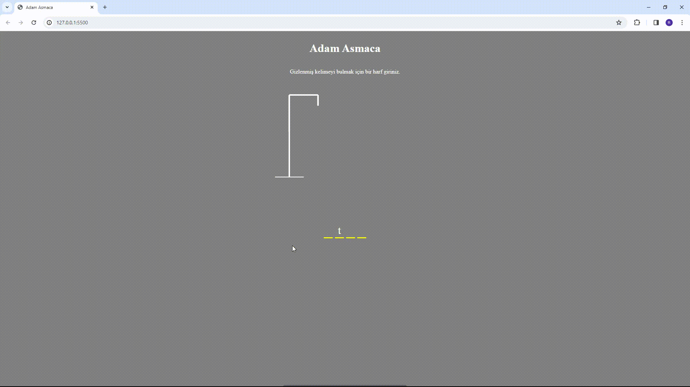

<h1>Game-Project</h1>

Nasıl Oynanır

-Oyun başladığında, rastgele seçilmiş bir kelime görüntülenir ve sizden bu kelimenin doğru harflerini tahmin etmeniz istenir.

-Doğru harfleri girdiğinizde, bu harfler ekranda gösterilir.

-Yanlış harfleri girdiğinizde, hatalı harfler listesine eklenir ve hatalı harf sayısı artar.

-Oyunun sonunda, tüm doğru harfleri tahmin ederseniz "Tebrikler kazandınız." mesajı görüntülenir. Eğer tüm hakkınızı kullanırsanız "Maalesef Kaybettiniz." mesajıyla karşılaşırsınız.

